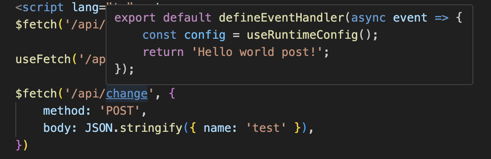
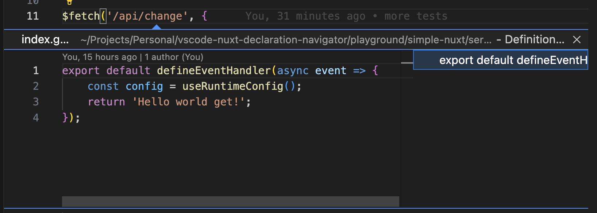

<p align="center">
  
</p>

> ⚠️ **Warning: This extension is deprecated. Please use the new extension [VSCode: Nuxt DX Tools](https://marketplace.visualstudio.com/items?itemName=alimozdemir.vscode-nuxt-dx-tools) Repository [Nuxt DX Tools](https://github.com/alimozdemir/vscode-nuxt-dx-tools).** ⚠️

# Vue/Nuxt Declaration Navigator

A VSCode extension for navigating `*.d.ts` files, designed to enhance Nuxt projects by auto-locating and navigating to auto-imported components, functions and routes.

## Motivation

The goal of this extension is to cover all Nuxt/Nitro related imports. We aim to integrate these features into the official Vue extension (`Vue.volar`).

## Features

- **Auto-locate and navigate to auto-imported components and functions in Nuxt projects:**
  - Instead of navigating to `.nuxt/components.d.ts`, it will find the actual component for you.
  - Supports built-in components such as `Head`, `Script`, and `NuxtLoadingIndicator`.

- **Auto-locate custom definitions like custom plugins:**
  - For example, if you have an `index.d.ts` file for your own definitions:

    ```typescript
    import type { IDialogPlugin } from "./types/DialogPlugin";

    declare module '#app' {
        interface NuxtApp {
            $dialog: IDialogPlugin,
        }
    }

    export {}
    ```

  - And you're using it like this:

    ```typescript
    const { $dialog } = useNuxtApp();
    ```

  - This extension will help you find the definition for `$dialog` as well.

- **Auto-locate server apis:**
  - By default, Nitro provides excellent support for APIs, including IntelliSense and configuration based on API definitions. This extension enhances your development experience by helping you quickly locate and navigate to the corresponding API files.

  - Supported logics
    - `$fetch` and `useFetch` are supported
    - For custom fetches (created by $fetch.create) see [Settings](#settings)
    - Method: `index.{method}.ts`
    - Parameters: `[id].ts`
    - `**` wildcards (e.g. `[...slug].ts`, `[...].ts`)

## Configuration

We recommend to set `editor.gotoLocation.multipleDefinitions` to `goto` for better experience. By this, it will automatically navigate to the file.

<p align="center">
  
</p>

### Settings

```json
  "configuration": {
    "title": "Vue/Nuxt Declaration Navigator",
    "properties": {
      "nuxtDeclarationNavigator.api.hover.enable": {
        "type": "boolean",
        "default": true,
        "description": "Enable/disable hover on nitro APIs extension."
      },
      "nuxtDeclarationNavigator.api.functions": {
        "type": "array",
        "default": ["$fetch", "useFetch"],
        "description": "List of functions to be considered as nitro APIs."
      }
    }
  }
```

## Examples

- **Auto-locate server apis:**
  - These are all supported syntaxes, once you hover you will be able to see the first 3 lines of the API file

  ```typescript
  $fetch('/api/myapi');

  useFetch('/api/myapi')

  $fetch('/api/change', {
      method: 'POST',
      body: JSON.stringify({ name: 'test' }),
  })

  $fetch('/api/change', {
      method: 'GET',
      body: JSON.stringify({ name: 'test' }),
  })

  $fetch('/api/change')

  const id = 1;

  $fetch(`/api/blog/` + id)

  $fetch('/api/blog/' + id)

  $fetch("/api/blog/" + id)

  $fetch(`/api/blog/${id}`)

  $fetch(`/api/blog/${id}/my-slug`)

  $fetch("/api/blog/" + id + '/new')

  $fetch("/api/blog/" + id + '/' + id)

  useFetch('/api/blog/' + id + '/my-blog-slug/and-more')
  ```
  <p align="center">
    Hover
    
  </p>

  <p align="center">
    Peek
    
  </p>


  ## Improvements

  - This extension can also support standalone nitro projects where just the backend.
  - Nuxt Layout support
  - Nuxt Middleware support