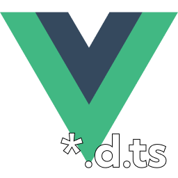
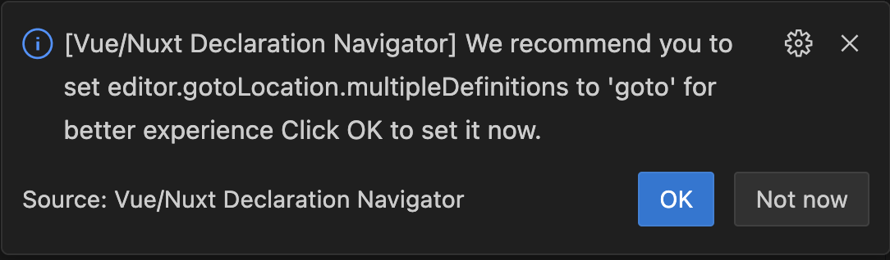

<p align="center">
  
</p>

# Vue/Nuxt Declaration Navigator

A VSCode extension for navigating `*.d.ts` files, designed to enhance Nuxt projects by auto-locating and navigating to auto-imported components and functions.

## Motivation

Cover all nuxt/nitro related imports. We would like to have this features in Vue Official Extension (`Vue.volar`). 

## Features

- Auto-locate and navigate to auto-imported components and functions in Nuxt projects.
  - Instead of navigating to `.nuxt/components.d.ts`, it will find the component for you
  - Built-in components e.g. (`Head`, `Script`, `NuxtLoadingIndicator`) also supported.

- Auto-locate custom definitions like custom plugins

Let's assume you have index.d.ts file for your own definitions.

```ts
import type { IDialogPlugin } from "./types/DialogPlugin";

declare module '#app' {
    interface NuxtApp {
        $dialog: IDialogPlugin,
    }
}

export {}
```

And you're using it like this

```ts
const { $dialog } = useNuxtApp();
```

This extension will help you to find the definition for $dialog as well.

## Configuration

We recommend to set `editor.gotoLocation.multipleDefinitions` to `goto` for better experience. By this, it will automatically navigate to the file.

<p align="center">
  
</p>